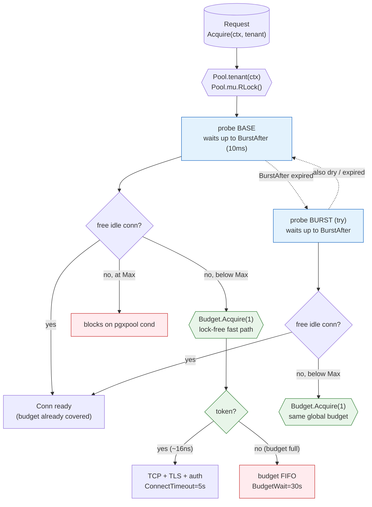
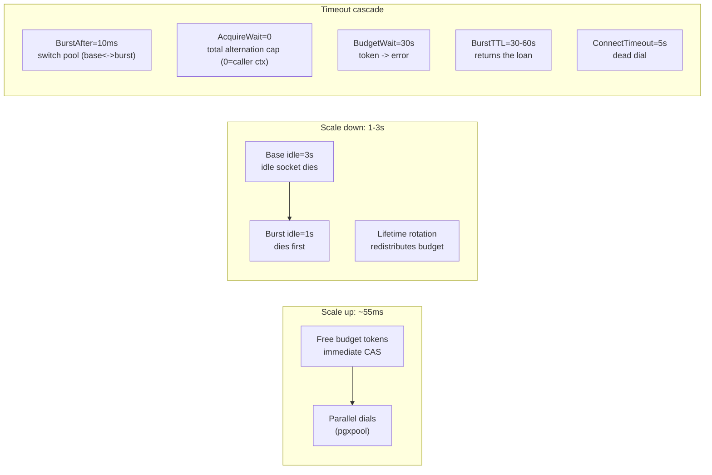
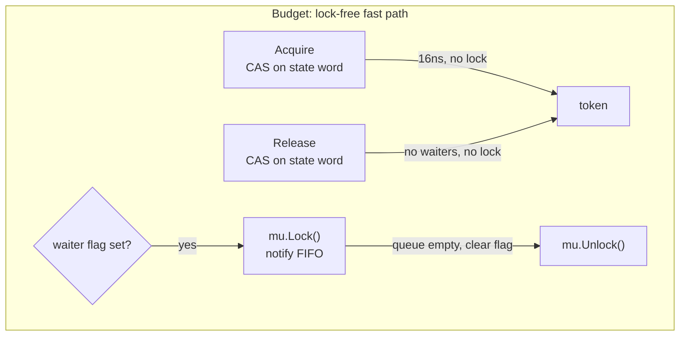
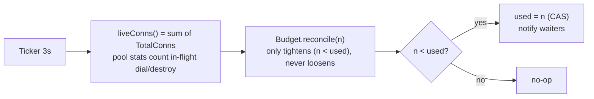

# Pool performance analysis

A living document about how the multitenant pool behaves under load, why each
path is fast or slow, and the lock-free design of the `Budget`.

Measurements: local database, `budget=60`, 9 tenants (3 per class
small/medium/large), burst of 1000 requests using
`SELECT pg_sleep(3..100ms)`, `idle=3s` base / `1s` burst,
`lifetime=30s`. Measured with the pool-demo load generator (removed;
see `git log`). The core ceiling and drain claims are re-validated live by
the integration suite in `load_test.go`.

---

## 1. Life cycle of an Acquire

A request asks for a connection in three layers, with a cascade of timeouts.

> The acquire **prefers the base**: a quick probe on the base first, a probe
> on the burst only when the base is saturated (zero idle), then a full wait
> on the base. The total combined wait is `AcquireWait` (0 = stop at caller
> ctx). If `tp.burst == nil` the acquire waits straight on the base.
> Details and trade-offs in `docs/parameters.md`.

### Cost per step (measured)

| Step | Cost | Comment |
|---|---|---|
| Tenant routing | ~ns | `RWMutex.RLock`, one map lookup |
| Budget fast path | **16 ns/op** | CAS on one atomic word, no lock |
| Burst absorption (dial) | **~55ms to peak** | parallel socket creation across tenants |
| Blocked by full budget | up to 30s | BudgetWait -> timeout error |

The dial at ~55ms dominates; lock contention in the budget does not show up
(section 3): the pool absorbs a spike of 1000 requests in ~55ms because
pgxpool creates sockets in parallel.

---

## 2. Timeouts and the up/down asymmetry

The asymmetry is intentional:

- **Scaling up is fast** (~55ms): token by CAS, socket created on demand, in
  parallel.
- **Scaling down is slow** (1-3s): connections do not die when a query ends;
  they stay idle until the idle timeout expires. This avoids thrashing
  (reconnecting on every request). With `idle=3s/1s`, the pool shrinks back
  to the floor in seconds.

Measured on a 1000-request burst:

| Class | Peak | Base drains (idle=3s) | Burst drains (idle=1s) |
|---|---|---|---|
| small (1/5+2) | 7 conns | 5 -> 1 in ~3s | 2 -> 0 in ~1s |
| medium (1/10+4) | 14 conns | 10 -> 1 in ~3s | 4 -> 0 in ~1s |
| large (1/15+5) | 20 conns | 15 -> 1 in ~3s | 5 -> 0 in ~1s |

---

## 3. Lock contention in the budget

The happy path of `Budget` is **lock-free**: `used` and a "are there
waiters?" flag live in one atomic word (`state`). A tenant that does not hit
the cap never touches the mutex. The mutex runs only when someone **needs to
wait** -- the expensive case anyway.

### Why the flag is correct

This is the same trick as `sync.RWMutex` (a sign bit inside the counter):

- The flag is set in the **same atomic operation** that proves the tokens are
  gone (`CompareAndSwap(s, s|waiterFlag)`).
- A concurrent `Release` that returns a token after that CAS reads the word
  with the flag set (total memory order) and does `notify` under the mutex.
  Waiters already in the queue get the token before any newcomer.

Coverage in `budget_test.go`:

- `TestBudgetFairnessUnderContention` -- 32 goroutines x 200 rounds with
  alternating saturation, under `-race`.
- `TestBudgetPriorityToWaiters` -- the oldest waiter is served before the
  newcomer.

Benchmark: `BenchmarkBudgetAcquireRelease` -> **14.8 ns/op, 0 allocs** on
the uncontended path (measured on a 13th-gen i7).

### The reconciler and the budget eraser

Why "only tightens": `TotalConns` from pgxpool still counts a socket that is
being destroyed asynchronously for ~500ms. Loosening would reserve tokens
that are already freed and blow the cap (measured: 96 real sockets with
budget 60). The reconciler fixes **leaks** (failed dial: `BeforeConnect`
charged the token, `BeforeClose` never runs). `Test04` covers this.

---

## 4. When does a tenant run out of connections?

The `Min` floor (a permanent reservation, covered by `Test01`) is **never
loaned out** -- an idle tenant keeps its guaranteed minimum. Lack of a
connection happens only in the **fungible** part (above Min), in three
scenarios:

| Scenario | Frequency | What the user sees |
|---|---|---|
| Global budget exhausted (spike > fungible) | every long spike; ~2s to saturate at 20x | p50/p99 latency rises: request waits in the FIFO queue up to BudgetWait |
| Tenant hits its own cap (base+burst) | sustained load > Max+Burst | `Acquire` blocks until a release; the drain (1-3s) unblocks it |
| Post-spike before the drain | 1-3s window | a new request finds the pool full and goes through -- no missing connection |

**Practical check:** with `budget=60`, 9 tenants, a 20x spike for 5s, the
budget saturates in ~2s and keeps a queue for ~3s. No tenant drops below
Min. The perceived difference is queue wait, not missing connections.
Lowering `BudgetWait` (e.g. 10s) caps the worst wait.

**General rule:** `Min=1` for *every* main pool -- classes differ only in
their cap. The reservation is one warm socket per tenant, not a throughput
slice: throughput is controlled by the **budget (semaphore)** in the fungible
pool above the sum of Mins. The burst pool is the exception: always
`Min=0`, its own cap, short idle -- pure spillover, no reserved floor.

---

## 5. Throughput by pool size

Burst of 1000 requests, one class at a time, `pg_sleep(3..100ms)` (avg ~50ms):

| Class | Connections (peak) | Time for 1000 req | Throughput | Efficiency* |
|---|---|---|---|---|
| small (1/5+2) | 7 | 26.5s | 38 req/s | ~27% |
| medium (1/10+4) | 14 | 13.2s | 76 req/s | ~27% |
| large (1/15+5) | 20 | 10.4s | 96 req/s | ~24% |

\* Efficiency = (1000 x 50ms of work) / (peak x time), relative to maximum
theoretical parallelism.

**Findings:**

- Throughput scales ~1.7x per class (76/7 -> 76/38 = 2.0x; 96/76 = 1.26x).
  Small -> medium is the best return: 2x throughput for +7 connections.
- The ~25% efficiency is not contention: it is the average M/D/1 queue case
  -- requests with a 5-100ms hold time enter a finite queue, and part of the
  peak sits idle while others wait. Sockets being built (~55ms) also do no
  work in that first instant.
- What a user notices moving from small to medium: p99 drops because the
  own-budget queue doubles, and serving 1000 requests falls from ~27s to
  ~13s.

Structural trade-off: each socket costs 1 budget token. Upgrading everyone
from small to medium (14x3=42 -> 84) requires raising `GlobalMaxConns`; that
is a capacity decision, not a code one.

---

## 6. What about a lock PER TENANT (sharded)?

Possible, but **counterproductive for the pool's purpose** -- and unnecessary:

- The point of the budget is **fungibility**: an idle tenant lends its
  tokens to a tenant in a peak, within the global cap. A per-tenant
  sub-budget splits that credit and increases -- not decreases -- the chance
  of a tenant missing a connection in its own slice while a neighbor is
  quiet.
- The lock-free fast path (section 3) removes the acquire/release cost when
  there is no wait. The remaining mutex runs only when someone is **blocked
  in the queue**, and there the wait (BudgetWait, up to 30s) dominates by
  orders of magnitude.

If telemetry ever shows the FIFO queue as the bottleneck (many tenants in
peak at once + low-core hardware), the next step would be a **budget per
class** (small/medium/large) with a global fungible pool on top -- not per
individual tenant.

---

## 7. Recommended for production

- `MaxConnIdleTime=3s` base, `BurstMaxConnIdleTime=1s` burst -- drains in a
  few seconds, without thrashing.
- Short `BudgetWait` (5-10s) if request p99 matters more than never failing.
- Low `MaxConnLifetime` (30s-1m) if tenants stay saturated for long: the
  rotation keeps the budget flowing between tenants.
- `ReconcileInterval=1-2s` to stop failed-dial leaks fast.
- Watch the pool with `Pool.Stat()`: `BudgetUsed`/`BudgetWaiters` show when
  the global cap is the bottleneck; `BurstSpillCount` is a leading indicator
  that a tenant's `Max` (or the budget) is too tight.